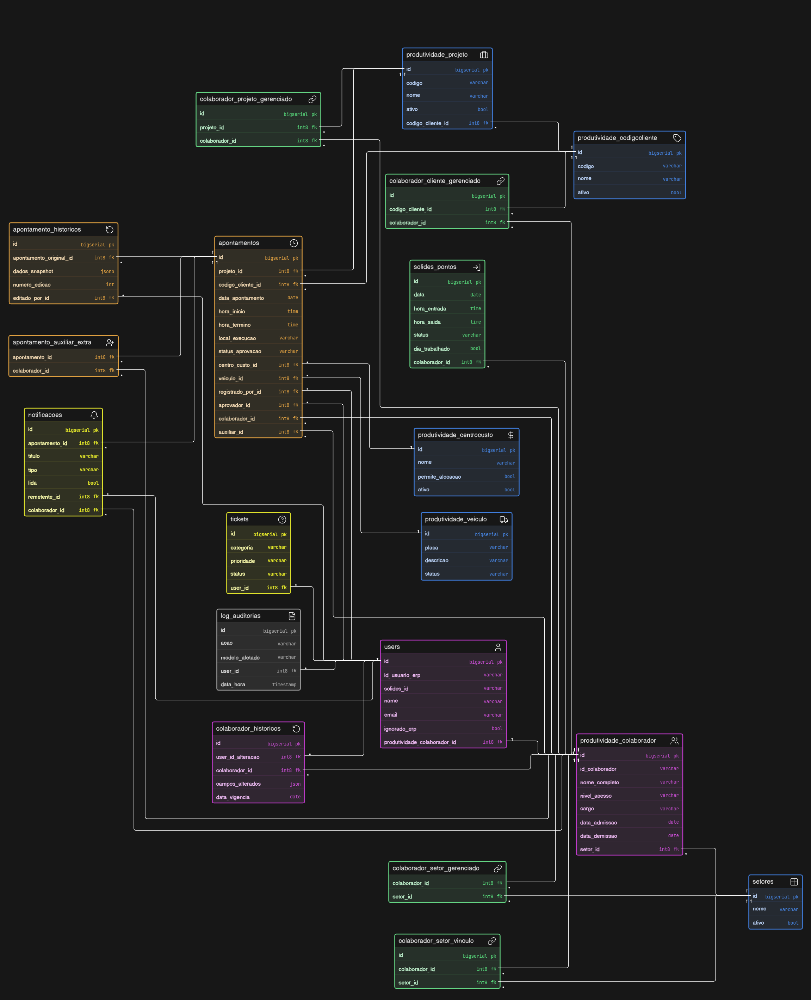

# Fase 2: Arquitetura e Integração

O Sistema de Timesheet foi desenhado para atuar em conjunto com o ERP matriz corporativo. Entender o fluxo de dados e os limites de onde o sistema atua como dono da informação é fundamental para o desenvolvimento e manutenção das integrações.

## 1. Fluxo de Dados e Topologia (Master vs Slave)

A arquitetura do banco de dados e as integrações via API obedecem a uma regra estrita de "Fonte da Verdade":

### Onde o Timesheet é a Fonte da Verdade (Master)
O sistema é o proprietário **exclusivo** das informações relacionadas ao trabalho diário. Todo dado que nasce no Timesheet, pertence ao Timesheet.
- **Apontamentos**: Registros de entrada, saída, local, projeto associado, veículos utilizados e horas de plantão/sobreaviso.
- **Auditoria de Apontamentos**: O histórico de edições e o versionamento de apontamentos alterados.
- **Autorização (Spatie)**: Embora o ERP possa definir o cargo, a matriz de acessos detalhada no Timesheet (quem pode aprovar o quê, visualizações cruzadas) é governada internamente no Laravel pelo pacote `spatie/laravel-permission`.

### Onde o Timesheet é Repositório (Slave)
O sistema atua como consumidor e espelho de dados estruturais que nascem e são mantidos pelo ERP, incluindo:
- **Usuários e Colaboradores**: O cadastro de pessoas é feito no ERP.
- **Estruturas Base**: Projetos, Obras, Setores, Clientes e Centros de Custo são sincronizados para permitir a amarração dos apontamentos.
*Nota*: Para garantir a integridade, o cadastro destas entidades é bloqueado no Timesheet (ou feito de maneira apenas emergencial e provisória), exigindo rotinas diárias/noturnas de Sync (via Jobs no Laravel).

## 2. Fluxo de Login e Integração de Usuários (SSO)

Para evitar duplicidade de senhas e atrito com os funcionários operacionais, a autenticação foi terceirizada para o ERP.
O fluxo de Single Sign-On (SSO) no Timesheet adota a técnica de **Just-In-Time (JIT) Provisioning**:

1. **Acesso**: O colaborador tenta acessar o Timesheet. Se não estiver logado, é redirecionado para a tela de interceptação que encaminha a autenticação para o ERP.
2. **Autenticação**: O ERP valida credenciais e retorna um *Ticket* seguro ao endpoint de Callback do Timesheet (`/auth/sso/callback`).
3. **Validação de Ticket (API-to-API)**: O `SsoController` no Laravel entra em contato *server-side* com o ERP enviando o Ticket. Se válido, o ERP retorna o Payload seguro contendo: `id_usuario`, `nome`, `email`, `nivel_acesso`, entre outros.
4. **JIT Provisioning (Criação/Atualização)**:
   - Se o usuário não existir na base do Timesheet (`firstOrNew` pelo `id_usuario_erp`), ele é criado na hora, recebendo os dados do Payload.
   - O Controller **sempre** atualiza as informações vitais (`email`, `solides_id`) para espelhar as alterações no ERP.
   - Os níveis de acesso (`nivel_acesso`) vindo do ERP são espelhados imediatamente convertendo-os para Roles do Spatie via `$user->syncRoles()`. Caso venha vazio na primeira vez, uma fallback role de `OPERACIONAL` é atribuída automaticamente.
5. **Sessão Segura**: O usuário é logado no Laravel utilizando a façade nativa (`Auth::login($user)`) e redirecionado ao seu Painel, tudo de forma transparente em milissegundos.

## 3. Modelo de Dados (Diagrama)

Para ilustrar de forma visual a estrutura descrita nesta documentação (Master vs Slave, amarrações de Colaboradores, Apontamentos e Histórico), você pode consultar o diagrama atualizado da nossa base de dados.

O diagrama detalha os principais relacionamentos:
- Vínculo do **User** com o **Colaborador**.
- Relação **Master** do **Apontamento** com Setores, Obras, e Veículos.
- O espelho N:N de **Setores Vinculados**.

