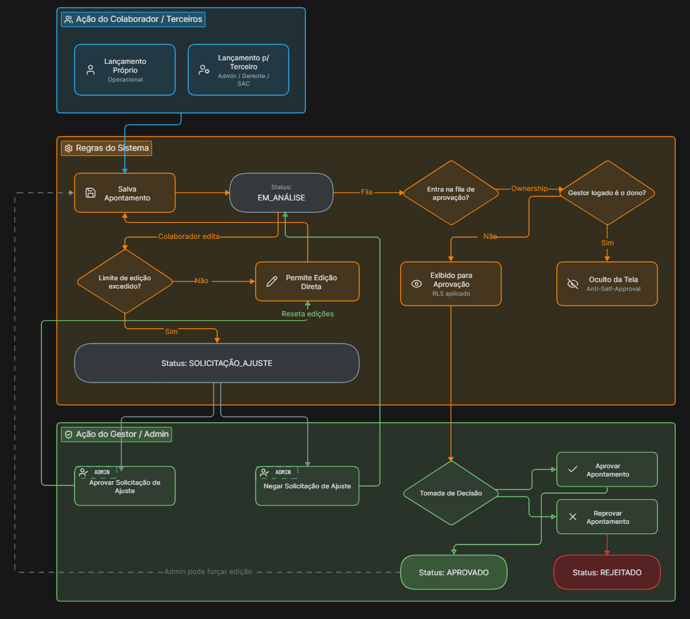
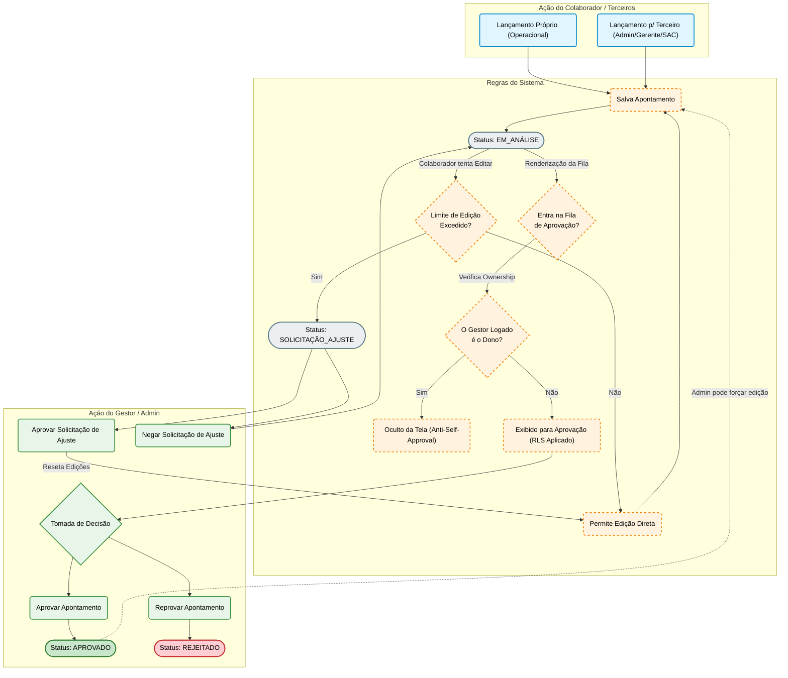

# 3. Regras de Negócio de Apontamentos

O coração do sistema é o gerenciamento da jornada de trabalho. Este documento detalha como ocorrem as validações que governam o processo de Apontamentos.

## 1. Fluxo CRUD de Apontamentos (Master)

O fluxo de Apontamento atua como o registro oficial para cálculo de horas da empresa:
- **Criação e Encerramento**: Cada apontamento possui data, hora de início e hora de término.
- **Vínculos Obrigatórios/Opcionais**: Apontamentos podem exigir vínculos como Projetos, Códigos de Cliente, Centros de Custo, bem como detalhes geográficos (Latitude/Longitude) e utilização de Veículos.
- **Histórico Snapshot**: Ao editar um Apontamento existente (seja pelo colaborador ou gestor), o Laravel salva um snapshot integral do estado anterior na tabela de `apontamento_historicos`, gerando uma trilha inviolável de auditoria.

## 2. A Regra Crítica do Plantão / Ocorrências

A validação de elegibilidade para ocorrências especiais, como **Plantão**, é processada de forma severa para evitar fraudes ou preenchimentos indevidos da folha. A elegibilidade é validada contra o ERP e possui a seguinte arquitetura de tempo:

### A Janela Oficial (17h às 07:30h)
Quando o usuário seleciona que um apontamento é de "Plantão", a API cruza os dados com o ERP. A janela padrão de Plantão começa às `17:00:00` do dia vigente e vai até às `07:30:00` do dia seguinte. 
Se a tentativa de apontamento cair fora desta janela, ele é invalidado.

### A Matemática da Madrugada
Para contemplar apontamentos que ocorrem depois da meia-noite (ex: entrada às 02h00), o sistema executa um "Ajuste de Madrugada":
- Se a *hora* do apontamento for **menor que 07:30**, o algoritmo compreende que o turno ainda pertence à escala do dia anterior. 
- O sistema decresce 1 dia da data atual para realizar a consulta da escala no ERP.

### Desempenho (Cacheamento TTL 1 Hora)
Como a checagem da escala de plantão exige um Request assíncrono para a matriz do ERP, utilizamos a camada de **Cache File** do Laravel (`Cache::remember`).
A resposta da API do ERP sobre o plantão vigente (chave genérica: `api_plantao_data`) é salva em cache por **1 hora** (`60 * 60` segundos). Isso impede o sobreaquecimento da API externa durante salvamentos massivos nas viradas de turno e na edição de apontamentos na Controller e Livewire. A elegibilidade individual é então validada em memória buscando o `id_usuario_erp` na resposta cacheada.

## 3. Reatividade no Frontend
Nos formulários de novos apontamentos, o preenchimento da `data` ou `hora` dispara callbacks no frontend (Javascript/AlpineJS) ou requisições AJAX (`api.timer.status`) que reavaliam os inputs e escondem/exibem campos como "Ocorrências de Plantão" caso o horário cruze a regra de negócios descrita acima.

## 4. Fluxo de Aprovação, Reprovação e Ajustes

Para entender o processo de aprovação de apontamentos por parte de terceiros ou pelo próprio usuário que requer edição extra, o diagrama abaixo ilustra todo o ciclo de vida.

### Diagrama do Fluxo (Mermaid)

### Entendendo o Fluxo

1. **Criação (Entrada)**: O apontamento nasce a partir de um lançamento próprio ou por um usuário com acesso superior (ex: Gerente lançando para a equipe). O sistema salva o registro e define o status inicial como `EM_ANÁLISE`.
2. **Ciclo de Edição**: 
   - Se o colaborador errar o lançamento, ele pode editar diretamente enquanto não atingir o limite de edições.
   - Caso atinja o limite, o sistema bloqueia a edição direta e o status muda para `SOLICITAÇÃO_AJUSTE`, exigindo que um gestor libere a alteração.
3. **Visibilidade (RLS e Anti-Self-Approval)**: Ao acessar a Central de Aprovações, o sistema avalia os apontamentos em análise. Se o gestor logado for o dono do apontamento, o registro é ocultado da sua tela. Se não for, ele é exibido (respeitando o filtro de equipe/setores).
4. **Veredito**: O Gestor pode `Aprovar` (travando o registro e contabilizando as horas) ou `Reprovar` (invalidando o lançamento).
