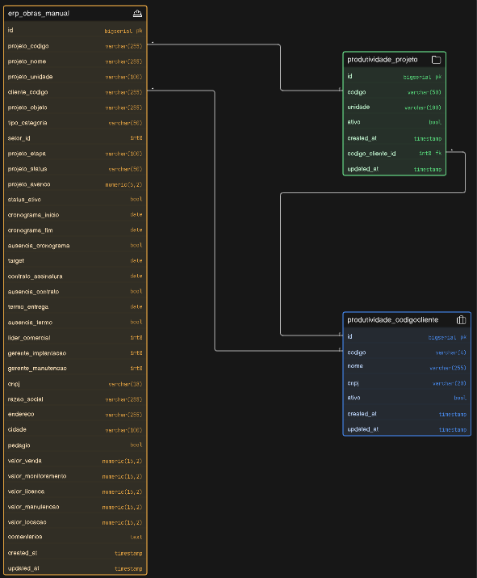

# 5. Arquitetura de Obras e Clientes (ERP Manual)

Este documento serve como guia definitivo sobre o funcionamento e a arquitetura do módulo de Obras e Clientes, refatorado para garantir consistência de dados, prevenção de duplicidades e sincronização inteligente com o modelo legado do sistema.

---

## 1. Visão Geral do Fluxo

A arquitetura foi projetada com o padrão **Observer** para separar a responsabilidade de entrada de dados (ERP Manual) da persistência normalizada do sistema legado (`produtividade_*`).

1. **Origem dos Dados (`erp_obras_manual`)**: Todas as criações e edições de Obras ocorrem através do `ErpObraManualController`. A tabela `erp_obras_manual` atua como a fonte da verdade bruta e "flat" (desnormalizada) para as informações cadastradas pelos usuários.
2. **Interceptação (Observer)**: Sempre que um registro é criado ou atualizado na tabela `erp_obras_manual`, o evento do Eloquent dispara o `ErpObraManualObserver`.
3. **Auditoria**: O Observer automaticamente gera um snapshot e salva o histórico da edição na tabela `controle_projetos_historico`.
4. **Distribuição e Normalização (`syncToProdutividade`)**: O Observer propaga as alterações para o modelo legado seguindo 3 etapas estruturadas:
   - **Etapa A (Cliente - Dados Cadastrais)**: Executa `updateOrCreate` na tabela `produtividade_codigocliente` atualizando apenas dados cadastrais (ex: `nome`), sem alterar o campo `ativo`.
   - **Etapa B (Projeto/Obra)**: Executa `updateOrCreate` na tabela `produtividade_projeto` vinculando a obra ao ID do Cliente e gravando o status específico (`ativo`).
   - **Etapa C (Recálculo Dinâmico de Status)**: Consulta o banco para verificar se o cliente ainda possui qualquer projeto ativo. O status `ativo` do cliente é recalculado dinamicamente com base nessa consulta.

> [!TIP]
> **Por que usar um Observer?** Isso garante que **nenhuma** Obra salva via API, Seeder, ou CLI escape da sincronização. A camada de banco de dados se mantém consistente automaticamente, sem depender de lógicas isoladas nos Controllers.

---

## 2. Dicionário de Dados e Relacionamentos

A espinha dorsal da prevenção de duplicidades reside nas **Chaves Únicas Compostas (Unique Constraints)** aplicadas no banco de dados.

### `erp_obras_manual`
Tabela principal que recebe as requisições de cadastro do sistema.
* **Constraints (Unique)**: `['cliente_codigo', 'projeto_codigo', 'projeto_unidade', 'cnpj']`.
A combinação dessas 4 colunas define a identidade absoluta de uma obra no ERP. Se as quatro forem iguais a um registro existente, o banco rejeitará o `INSERT`.

### `produtividade_codigocliente`
Tabela normalizada que armazena os clientes.
* **Constraints (Unique)**: `['codigo', 'cnpj']`.
Permite que um mesmo código (ex: `1234`) tenha múltiplas filiais, desde que os CNPJs sejam diferentes.

### `produtividade_projeto`
Tabela normalizada que armazena os projetos.
* **Foreign Key**: `codigo_cliente_id` (Relaciona-se com `produtividade_codigocliente(id)`).
* **Constraints (Unique)**: `['codigo_cliente_id', 'codigo', 'unidade']`.
* **Nota Importante**: A coluna física `nome` foi **removida** desta tabela para evitar dupla fonte de verdade, visto que o nome do projeto é derivado do cliente.

---

## 3. Regras de Negócio e Tratamento de Dados

Para evitar que constraints quebrem por erros de digitação (ex: CNPJ com máscara vs sem máscara, ou nulos), o Laravel sanitiza os dados **antes** da validação usando o FormRequest.

### Sanitização no `ErpObraManualRequest@prepareForValidation`
* **Limpeza de Máscaras (CNPJ)**: Qualquer CNPJ recebido (ex: `00.000.000/0001-91`) tem todos os caracteres não numéricos limpos via `preg_replace('/[^0-9]/', '', $cnpj)`. No banco, o CNPJ é gravado **apenas com números**. Isso garante que a verificação de duplicidade da Unique Constraint não falhe por causa de pontos ou traços.
* **Valores Financeiros**: Regra similar é aplicada para valores (Ex: `R$ 1.500,00` é convertido para `1500.00`).
* **Fallback de Unidade (`N/A`)**: Como o campo `projeto_unidade` faz parte da chave única, ele **não pode ser nulo**, caso contrário a engine de banco de dados (dependendo do SGBD) poderia ignorar a constraint para valores nulos. Portanto, se a unidade vier vazia, o sistema aplica um merge silencioso do valor `'N/A'`.

### Recálculo Dinâmico do Status do Cliente (`ativo`)
* **Regra de Negócio**: Um cliente **nunca** herda cegamente o status inativo de uma única obra. O cliente só deve ser inativado se **todos** os projetos a ele vinculados estiverem inativos. Se houver pelo menos um projeto ativo, o cliente deve permanecer ativo.
* **Fluxo de Validação no Observer**:
  1. No `updateOrCreate` do cliente, o campo `ativo` não é informado, preservando o status existente (ou assumindo o default `true` em novos cadastros).
  2. A obra é salva com seu status real (`ativo = $obra->status_ativo`).
  3. Logo após a gravação da obra, o Observer faz uma consulta direta:
     ```php
     $temProjetoAtivo = \App\Models\Projeto::where('codigo_cliente_id', $cliente->id)
         ->where('ativo', 1)
         ->exists();

     $cliente->update(['ativo' => $temProjetoAtivo ? 1 : 0]);
     ```
  Isso previne que a inativação de uma filial ou contrato específico desative o cliente por completo enquanto ele ainda tiver outros contratos em andamento.

---

## 4. Comportamento do Frontend (UX/UI)

Para evitar que o usuário só descubra que a obra é duplicada após submeter o formulário, a view `index.blade.php` implementa uma UX assíncrona agressiva, orientada pelo backend.

### Rota e Lógica AJAX
Sempre que os campos CNPJ ou Código do Projeto sofrem interação, uma requisição `POST /erp-obras-manual/verificar-cliente` é disparada (protegida por CSRF). O Controller avalia os dados e responde como o DOM deve se comportar:

1. **Trava Global de Razão Social**: Independentemente de qualquer outra checagem, se o CNPJ digitado já existir no banco de dados, o backend retorna a `razao_social`. O frontend intercepta isso, **preenche e trava (readonly)** o input de Razão Social, impedindo alterações acidentais de um dado imutável.

2. **Ações sobre o "Nome do Projeto"**:
   * `acao: travar`: Há um "Match Exato" (Código do Cliente + CNPJ já existem juntos). O campo "Nome do Projeto" é preenchido com o nome existente e o campo é bloqueado para edição (`readonly`). O sistema entende que trata-se da MESMA obra, e evita a duplicidade no nascimento.
   * `acao: sugerir`: O Código do Cliente existe, mas atrelado a outros CNPJs. O frontend oculta o input de texto e renderiza um `<select>` com as opções de nomes usados pelas outras filiais, além de um botão "Outro (Digitar Novo)" que devolve o modo texto.
   * `acao: livre`: O Código não existe no sistema. Um input de texto limpo e desbloqueado é oferecido.

> [!IMPORTANT]
> **Prevenção Dupla**: A duplicidade silenciosa foi travada em duas barreiras: No Frontend (o usuário não consegue digitar sobre um Match Exato) e no Backend (FormRequest Validation + Unique Constraints das Migrations).

---

## 5. Accessors e Virtualização

Na tabela `produtividade_projeto`, a coluna física `nome` foi removida em prol da normalização (o projeto herda o nome do cliente nesta nova arquitetura). 

Para não quebrar partes antigas do sistema (views legadas, controllers de apontamento) que esperavam ler `$projeto->nome`, foi introduzida a **Virtualização através de Accessors** no Model `Projeto`:

```php
public function getNomeAttribute(): string
{
    return $this->cliente ? $this->cliente->nome : 'N/A';
}
```

Isso garante **Retrocompatibilidade Absoluta**: Em qualquer lugar do sistema que chamar `$projeto->nome`, o Laravel intercepta a chamada magicamente e devolve a propriedade `nome` do relacionamento `$projeto->cliente`, mantendo a fluidez da aplicação e a integridade da arquitetura sem redundância de dados.

---

## 6. Apêndice: Definições DDL (SQL Bruto)

Abaixo estão os scripts DDL gerados diretamente do banco de dados, evidenciando as estruturas e *constraints* de cada tabela envolvida neste fluxo.



```sql
-- public.erp_obras_manual definition

-- Drop table
-- DROP TABLE public.erp_obras_manual;

CREATE TABLE public.erp_obras_manual (
    id bigserial NOT NULL,
    cliente_codigo varchar(255) NULL,
    projeto_codigo varchar(255) NULL,
    projeto_nome varchar(255) NULL,
    status_ativo bool DEFAULT true NOT NULL,
    tipo_categoria varchar(50) NULL,
    projeto_unidade varchar(100) NULL,
    projeto_objeto varchar(255) NULL,
    setor_id int8 NULL,
    projeto_etapa varchar(100) NULL,
    projeto_status varchar(50) NULL,
    ausencia_cronograma bool DEFAULT false NOT NULL,
    cronograma_inicio date NULL,
    cronograma_fim date NULL,
    projeto_avanco numeric(5, 2) NULL,
    lider_comercial int8 NULL,
    gerente_implantacao int8 NULL,
    gerente_manutencao int8 NULL,
    "target" date NULL,
    contrato_assinatura date NULL,
    ausencia_contrato bool DEFAULT false NOT NULL,
    termo_entrega date NULL,
    ausencia_termo bool DEFAULT false NOT NULL,
    cnpj varchar(18) NULL,
    razao_social varchar(255) NULL,
    endereco varchar(255) NULL,
    cidade varchar(100) NULL,
    pedagio bool DEFAULT false NULL,
    valor_venda numeric(15, 2) NULL,
    valor_monitoramento numeric(15, 2) NULL,
    valor_licenca numeric(15, 2) NULL,
    valor_manutencao numeric(15, 2) NULL,
    valor_locacao numeric(15, 2) NULL,
    comentarios text NULL,
    created_at timestamp(0) NULL,
    updated_at timestamp(0) NULL,
    CONSTRAINT erp_obras_manual_ausencia_contrato_not_null NOT NULL ausencia_contrato,
    CONSTRAINT erp_obras_manual_ausencia_cronograma_not_null NOT NULL ausencia_cronograma,
    CONSTRAINT erp_obras_manual_ausencia_termo_not_null NOT NULL ausencia_termo,
    CONSTRAINT erp_obras_manual_composite_unique UNIQUE (cliente_codigo, projeto_codigo, projeto_unidade, cnpj),
    CONSTRAINT erp_obras_manual_id_not_null NOT NULL id,
    CONSTRAINT erp_obras_manual_pkey PRIMARY KEY (id),
    CONSTRAINT erp_obras_manual_status_ativo_not_null NOT NULL status_ativo
);


-- public.produtividade_codigocliente definition

-- Drop table
-- DROP TABLE public.produtividade_codigocliente;

CREATE TABLE public.produtividade_codigocliente (
    id bigserial NOT NULL,
    codigo varchar(4) NOT NULL,
    nome varchar(255) NOT NULL,
    ativo bool DEFAULT true NOT NULL,
    created_at timestamp(0) NULL,
    updated_at timestamp(0) NULL,
    cnpj varchar(20) NULL,
    CONSTRAINT produtividade_codigocliente_ativo_not_null null,
    CONSTRAINT produtividade_codigocliente_codigo_cnpj_unique null,
    CONSTRAINT produtividade_codigocliente_codigo_not_null null,
    CONSTRAINT produtividade_codigocliente_id_not_null null,
    CONSTRAINT produtividade_codigocliente_nome_not_null null,
    CONSTRAINT produtividade_codigocliente_pkey null
);


-- public.produtividade_projeto definition

-- Drop table
-- DROP TABLE public.produtividade_projeto;

CREATE TABLE public.produtividade_projeto (
    id bigserial NOT NULL,
    codigo_cliente_id int8 NULL,
    codigo varchar(50) NULL,
    ativo bool DEFAULT true NOT NULL,
    created_at timestamp(0) NULL,
    updated_at timestamp(0) NULL,
    unidade varchar(100) NULL,
    CONSTRAINT produtividade_projeto_ativo_not_null null,
    CONSTRAINT produtividade_projeto_codigo_cliente_id_codigo_unidade_unique null,
    CONSTRAINT produtividade_projeto_codigo_unique null,
    CONSTRAINT produtividade_projeto_id_not_null null,
    CONSTRAINT produtividade_projeto_pkey null,
    CONSTRAINT produtividade_projeto_codigo_cliente_id_foreign FOREIGN KEY (codigo_cliente_id) REFERENCES public.produtividade_codigocliente(id) ON DELETE SET NULL
);
```
